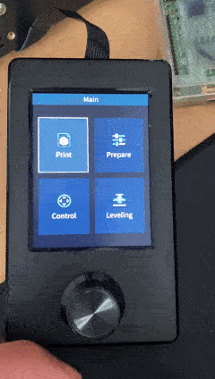
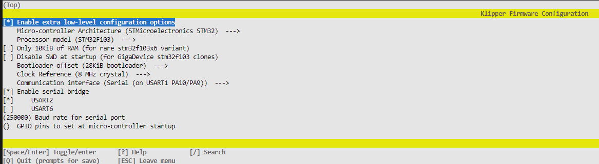

Ласкаво просимо до проекту Klipper!

[] (https://www.klipper3d.org/)

https://www.klipper3d.org/

Klipper - це прошивка для 3d-принтерів. Вона поєднує в собі потужність комп'ютера загального
комп'ютера загального призначення з одним або кількома мікроконтролерами. Див.
[документ про можливості] (https://www.klipper3d.org/Features.html) для отримання додаткової
інформацію про те, чому варто використовувати Klipper.

Щоб почати користуватися Klipper, виконайте наступні дії
[встановлення](https://www.klipper3d.org/Installation.html) його.

Klipper є вільним програмним забезпеченням. Перегляньте [ліцензію] (КОПІЮВАННЯ) або прочитайте
[документацію](https://www.klipper3d.org/Overview.html). Ми залежимо від
від щедрої підтримки наших
[спонсорів] (https://www.klipper3d.org/Sponsors.html).

Ця прошивка є форком 3 репозитаріїв: офіційної, виміру z-offset та проекту з роботою з стадарним дисплеєм. посилання на них ви знайдете в розділі "Інші корисні посилання". Проект сворений для того щоб отримати більш повне задоволення від роботи з klipper

[](https://github.com/Atomique13/ender3-v3-se-klipper-with-display/actions/workflows/build-firmware.yaml)

# Модифікований кліпер для Creality Ender 3 V3 SE з підтримкою дисплея

Це модифікований [Klipper](https://www.klipper3d.org/), який підтримує оригінальний дисплей **Creality E3V3SE (Ender 3 V3 SE)** шляхом поєднання [E4ST2W3ST послідовного моста](https://github.com/Klipper3d/klipper/commit/6469418d73be6743a7130b50fdb5a57d311435ca) з [ender 3 v3 se display interface](https://github.com/jpcurti/E3V3SE_display_klipper), щоб зробити можливим використання кабелю дисплея принтера без будь-яких апаратних модифікацій. Цей сховище є форком [0XD34Ds klipper config](https://github.com/0xD34D/klipper_ender3_v3_se), але його коміти можна застосовувати окремо від будь-якої іншої конфігурації.



## Встановлення

### Використання готових двійкових файлів
Скопіюйте файл `.bin` з [релізу](https://github.com/jpcurti/ender3-v3-se-klipper-with-display/releases) на SD-карту і прошийте його у принтер так само, як ви робите це під час встановлення klipper. **Примітка: не забудьте перейменувати файл на інше ім'я, ніж ім'я останнього прошитого двійкового файлу, інакше принтер не розпізнає його як новий файл і не оновить.**

### Клонування проекту і збірка з вихідних текстів
Клонуйте проект, перейдіть до каталогу сховища і налаштуйте збірку за допомогою `make manuconfig`:
```sh
git clone https://github.com/jpcurti/ender3-v3-se-klipper-with-display
cd ender3-v3-se-klipper-with-display
make menuconfig
```
У меню конфігурації увімкніть послідовний міст для **USART2** та параметри klipper для Ender 3 v3 se:


Після цього створіть власні двійкові файли за допомогою `make`, скопіюйте `klipper.bin` з вихідної теки на SD-карту і прошийте так само, як ви робите це з klipper.

## Налаштування
Щоб увімкнути дисплей, до вашого `printer.cfg` потрібно додати розділ під назвою `[e3v3se_display]`. Крім того, ви можете встановити власну мову та протоколи (за замовчуванням english та false відповідно), як-от

```yaml
[e3v3se_display]
мова: португальська
logging: True
```

## Підтримувані функції
Наразі підтримуються такі функції:

| Функція | Статус
| ---------------------- | ------- |
| Друк файлу | &check;; &check;; &check;; &check;; &check;; &check
| Налаштувати друк | &check; &check; &check; &check; &check; &check; &check
| Призупинити/продовжити друк | &check;; &check;; &check;; &check;; &check
| Зупинити друк.
| Перемістити вісь | &check; &check; &check; &check; &check; &check; &check
| Початкова вісь | &check; &check; &check; &check; &check
| Встановити зсув по осі Z.
| Вимкнути крокові двигуни.
| Підігріти станину.
| Охолодження.
| Встановити температуру форсунок.
| Встановити температуру станини.
| Встановити максимальну швидкість.
| Встановити максимальне прискорення.
| Встановити крок на мм.
| Меню вирівнювання | &cross; | &cross; &cross; &cross; &cross; &cross; &cross

Функції, які недоступні, відображаються у спливаючому вікні:


## Важливо
- Цей проект базується на прошивці дисплея **E3V3SE 1.0.6**. Будь-які зміни у версії прошивки, такі як нова версія від Creality, можуть змінити розташування ресурсів у пам'яті дисплея, що потребуватиме нового відображення. Список доступних прошивок можна знайти [на сайті Creality](https://www.creality.com/pages/download-ender-3-v3-se), а детальну інструкцію про те, як оновити ваш дисплей, можна знайти на [youtube](https://www.youtube.com/watch?v=8oRuCusCyUM&ab_channel=CrealityAfter-sale).

## Пов'язані проекти та кредити:
- Цей репозиторій значною мірою базується на репозиторії [DWIN_T5UIC1_LCD](https://github.com/odwdinc/DWIN_T5UIC1_LCD) для дисплея E3V2 і використовує більшість доступних класів та методів, реалізованих у ньому, з необхідними модифікаціями для дисплея E3V3SE. Усі заслуги належать [автору проекту DWIN_T5UIC1_LCD](https://github.com/odwdinc) за створення версії, на якій базується цей репозиторій.

- Цей репозиторій містить запропоновану [E4ST2W3ST](https://github.com/Klipper3d/klipper/commit/6469418d73be6743a7130b50fdb5a57d311435ca) зміну, яка дозволяє MCU працювати як послідовний міст між USB і послідовним портом дисплея. Без його роботи цей проект не існував би.

- Цей репозиторій є форком і використовує вже готову конфігурацію для ender 3 v3 se, створену [0XD34D](https://github.com/0xD34D/klipper_ender3_v3_se), де було зроблено багато різних покращень.

## ПОШИРЕНІ ЗАПИТАННЯ

### Принтер не прошиває .bin з випусків або зібраний з вихідного коду
Будь ласка, перевірте, чи перейменовуєте ви двійкові файли між перепрошивками, як зазначено у розділі [Використання попередньо зібраних двійкових файлів] (#using-pre-built-binaries)

### Після встановлення цього проекту мій дисплей з'їхав з глузду!
Перевірте, чи встановлено прошивку дисплея **E3V3SE 1.0.6**, як зазначено у розділі [Важливо](#important)

### Я знайшов помилку у графічному інтерфейсі або щось працює не так, як очікувалося
Будь ласка, [відкрийте тему для повідомлень про помилки/запитів про можливості](https://github.com/jpcurti/ender3-v3-se-klipper-with-display/issues) і поставте питання в [обговоренні проекту](https://github.com/jpcurti/ender3-v3-se-klipper-with-display/discussions)

## Інші корисні посилання

https://www.klipper3d.org

https://octoprint.org/

https://github.com/arksine/moonraker

https://github.com/odwdinc/DWIN_T5UIC1_LCD

https://github.com/jpcurti/E3V3SE_display_klipper

https://github.com/0xD34D/klipper_ender3_v3_se

https://github.com/jpcurti/ender3-v3-se-klipper-with-display
